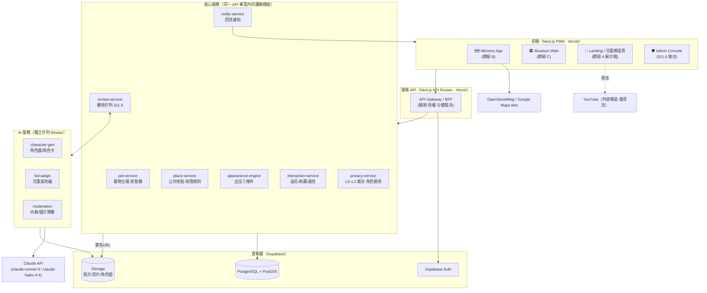
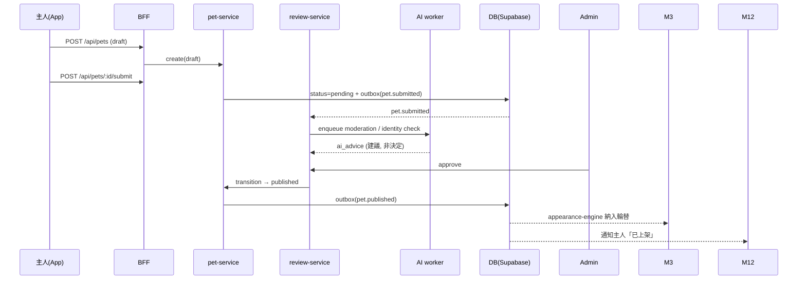
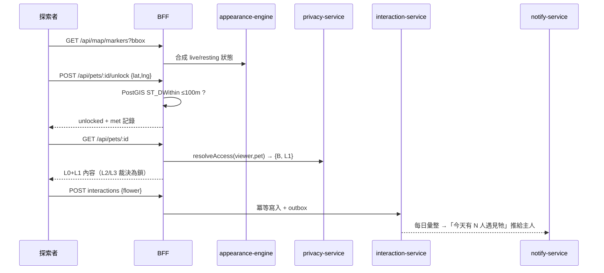
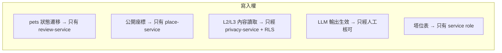

# 01 · Product Architecture — 系統架構文件 v1.0

> 依《Pet Memory Map Project v1.0 專案訂版文件》§16.3 技術範圍與 §21 Phase 1–3 撰寫。
> 本文件定義：**系統架構、功能模組界定、串接模組界定、模組與端點（含資料庫、LLM）之間的契約關係**。
> 已由 demo（`pet-memory-map-demo.html`）驗證過的機制標記為 ✅demo；未驗證者標記為 🔲。
> 相關文件：《02_使用者分級_私密陪伴》（角色×分層規格）、《03–05》（兒童內容管線）。

---

## 0. 架構原則（先訂規則，再訂零件）

1. **問題錨定**：每個模組必須能回答訂版文件 §24 的五個問題之一（真實故事／地點探索／情緒互動／回流主人／塔位價值），答不出來就不屬於 v1。
2. **契約先行**：模組之間只透過本文件定義的 API／事件／資料表溝通，不允許私下耦合。
3. **隱私是資料層的事，不是 UI 的事**：L0–L3 洋蔥分層在**資料庫列級（RLS）與 API 層**強制，前端只是呈現。UI 藏起來≠安全。
4. **LLM 是「產生候選」，不是「決定發布」**：所有 LLM 輸出（角色圖、兒童改編、審核建議）一律進入人工審核佇列，不得直接上線（§11.6、§12.3）。
5. **地點永遠是公共近似點**：任何寫入地圖的座標必經 `place-service` 白名單或人工核可；私宅/門牌/塔位座標在 schema 層就不存在「可公開」欄位。

---

## 1. 系統總覽

### 1.1 拓撲圖



### 1.2 技術選型（凍結 · §16.3）

| 層 | 選型 | 備註 |
|---|---|---|
| 前端 | Next.js 14+（App Router）· PWA | 單一 codebase 出 App/Museum/Admin 三個 route group |
| 地圖 | Google Maps JS API（正式）／OSM+Leaflet（demo 已用 ✅demo） | 標記聚合 ✅demo |
| 後端 | Next.js API Routes（v1 不拆 FastAPI，除非 AI worker 需要 Python） | BFF 模式 |
| 資料庫 | PostgreSQL + PostGIS（Supabase） | RLS 強制分層 |
| 儲存 | Supabase Storage | 照片原檔私有、公開層用轉檔後的公開桶 |
| 登入 | Supabase Auth（Email/Apple/Google/LINE） | JWT 內帶 user_id |
| LLM | Claude API：`claude-sonnet-5`（改編/審核）·`claude-haiku-4-5`（輕量分類） | 圖像生成另接影像模型，v1 可先人工上傳角色圖 |
| 部署 | Vercel（前端+API）· Supabase（資料）· Cron/Queue：Supabase pg_cron + 佇列表 | |

---

## 2. 功能模組界定

> 每個模組定義：**職責／不做什麼（邊界）／對外契約**。「不做什麼」與職責同等重要。

### M1 · pet-service（寵物主檔）
- **職責**：寵物 CRUD、狀態機（`draft → pending → published → unlisted`）✅demo、型態（memorial/living/honor）✅demo、與塔位主檔的對應（§14）。
- **不做**：不判斷可見性（交給 privacy-service）、不算出沒（交給 appearance-engine）、不直接改審核狀態（只有 review-service 能觸發狀態遷移）。
- **對外契約**：REST `/api/pets/*`（§5.1）＋事件 `pet.published`、`pet.status_changed`。

### M2 · place-service（公共地點與地理規則）
- **職責**：公共地點白名單（公園/河濱/廣場/寵物友善場所…§10.2）、自訂地點的人工核可佇列 ✅demo、座標模糊化（發布時 snap 到地點中心 + ≤50m 抖動）、地理查詢（`ST_DWithin` 附近搜尋）。
- **不做**：不儲存任何私宅／門牌／塔位座標為可公開欄位（schema 不存在該欄位）；塔位座標只存在 `tomb_units`（永不出 API）。
- **對外契約**：`/api/places/*`；內部函式 `resolvePublicPoint(placeId) → geometry`。

### M3 · appearance-engine（出沒引擎）
- **職責**：實作 §10.3 三條件 ✅demo：`在輪值 ∧ 未達每日曝光上限 ∧ 在出沒時段`；每日 00:00 輪替重算（pg_cron）；輸出每隻寵物當下狀態 `live / resting(rotation|cap|time)`。
- **不做**：不做複雜隨機演算法（訂版禁止）；不追蹤使用者即時背景位置（§20）。
- **對外契約**：`/api/map/markers`（已含狀態）；內部視圖 `v_pet_appearance`。

### M4 · privacy-service（分層與角色裁決）★ 全系統的守門員
- **職責**：實作《02》的洋蔥分層：給定 `(viewer_user_id, pet_id)` 回傳 `relation ∈ {A1,A2,A3,F,B,C-admin}` 與 `max_layer ∈ {L0,L1,L2,L3}` ✅demo；A1 額外裁決「實體鑰匙」（塔位現場 geofence）✅demo。
- **不做**：不信任前端傳來的 role；一律由 `pet_members` 表推導。
- **對外契約**：內部函式 `resolveAccess(viewer, pet) → {relation, maxLayer, tombKey}`；所有讀取 API 必經此函式；DB 端以 RLS policy 重複強制（雙保險）。

### M5 · interaction-service（三種互動）
- **職責**：送花/收藏/已遇見 ✅demo；依型態換語彙（獻花/祝福/致敬）✅demo；冪等（同人同寵一次）；寫入即發 `interaction.created` 事件供回流。
- **不做**：不做留言區公開社交（§16.2 延後）；家族留言牆屬 M6。
- **對外契約**：`/api/pets/:id/interactions`。

### M6 · family-wall（家族留言牆 · L2）
- **職責**：家族層私密留言 ✅demo；只有 `relation ∈ {A1,A2,A3,F}` 可讀寫。
- **不做**：不對外公開、不可被搜尋、不進任何推薦。
- **對外契約**：`/api/pets/:id/family-wall`。

### M7 · review-service（審核佇列 · §11.6）
- **職責**：五項檢查 ✅demo（故事內容、地點安全、圖片、身分驗證、角色生成狀態）；呼叫 AI moderation 產生**建議**；人工核可/退回；核可後觸發 `pet.published`。
- **不做**：不自動發布（LLM 建議僅供參考）；不刪資料（退回=狀態遷移+留言）。
- **對外契約**：`/api/admin/review/*`；事件 `review.approved` / `review.rejected`。

### M8 · identity-verify（身分驗證）
- **職責**：A1 塔位合約自動比對（`tomb_contracts`）✅demo、A3 生前契約比對、A2 證明文件上傳＋人工佇列 ✅demo、C 機關授權書。
- **不做**：不保存證件原檔超過審核期（審核後 30 天銷毀，只留結果）。
- **對外契約**：`/api/verify/*`；結果寫入 `pet_members.verified_as`。

### M9 · guardian-service（守護者 · §15.3）
- **職責**：守護者關係 ✅demo、（Phase 5）訂閱扣款狀態。
- **不做**：v1 不做投資/分潤/所有權（訂版禁止）；demo 階段不含金流。

### M10 · tomb-linkage（塔位現場連動 · A1 專屬）
- **職責**：塔位 QR（簽名短連結 → Museum Page）✅demo、現地 geofence 解鎖私密留言 ✅demo、實體獻花↔數位同步（館方櫃台 App 記一筆）✅demo。
- **不做**：塔位座標永不進入公開地圖（§14）。
- **對外契約**：`/api/tomb/:token/*`（token 簽名、限 A1/F）。

### M11 · kid-content（兒童版與內容池 · §12）
- **職責**：每隻寵物的兒童版欄位 ✅demo（真實/改編明確區分）、`kids_ok` 授權旗標、兒童內容池清單（供頻道製作，即《03–05》管線）、LLM 改編草稿（M-AI2）。
- **不做**：不在主 App 內嵌影片（效能，已驗證的獨立頁策略 ✅demo）；不違反 §12.3 禁令。

### M12 · notify-service（回流通知）
- **職責**：互動彙整回流主人（「今天有 3 人遇見麻糬」）、審核結果通知、忌日/生日年度紀念觸發（pg_cron）。
- **不做**：不即時推播每一筆互動（彙整，避免打擾）。

### M13 · museum-web（模組 C 前台）
- **職責**：永久故事頁（SSR/SSG，SEO 友善）、Museum Page 欄位（§13）✅demo、互動統計。
- **不做**：不繞過 privacy-service 直讀資料。

### M14 · admin-console（後台前端）
- **職責**：M7/M8 的操作介面 ✅demo、內容下架、申訴處理。

---

## 3. 串接模組界定（外部整合）

| 整合 | 方向 | 用途 | 契約要點 | 失效降級 |
|---|---|---|---|---|
| **Supabase Auth** | 前端↔Auth | 登入、JWT | JWT `sub`=user_id；API 一律驗簽 | 匿名可瀏覽 L0/L1，互動需登入 |
| **Supabase Storage** | API↔STG | 照片/影片/角色圖 | 私有桶＋簽名 URL（15 min）；公開層走轉檔公開桶 | 圖掛→前端 emoji 後備 ✅demo |
| **PostGIS** | Core↔PG | 附近查詢/geofence | 統一 SRID 4326；`ST_DWithin` 公尺級 | — |
| **Google Maps / OSM** | 前端↔EXT | 底圖與聚合 | 只送公共近似座標；不送使用者軌跡 | OSM 後備 ✅demo |
| **Claude API** | AI worker↔Anthropic | 見 §6 | 佇列重試、逾時 30s、輸出必過 JSON schema 驗證 | 佇列滯留→人工代寫 |
| **YouTube** | 單向導流 | 兒童頻道（§12） | 平台只出「內容池包」（劇本/素材/授權清單）；不回寫 | — |
| **QR/短連結** | 實體↔線上 | 塔位 QR | 簽名 token，可撤銷 | 掃碼失敗顯示館方客服 |

---

## 4. 資料模型（PostgreSQL + PostGIS）

> 只列核心表與關鍵欄位；`※RLS` = 有列級安全政策。

```sql
-- 使用者（Auth 之外的擴充檔）
users(id uuid PK, display_name, created_at)

-- 寵物主檔（M1）※RLS
pets(
  id uuid PK,
  status text CHECK (status IN ('draft','pending','published','unlisted')),
  kind text CHECK (kind IN ('memorial','living','honor')),      -- 型態 ✅demo
  name, species, breed, sex, born_year int, died_year int,      -- died_year NULL = living
  org_name text,                                                 -- honor 專用（如「士林分局」）
  cover_photo_id uuid, character_asset_id uuid,                  -- 真實照 / 角色圖
  created_by uuid FK users, created_at, published_at
)

-- 分層內容（洋蔥 L0–L3 落在「內容」上）※RLS ★核心設計
pet_contents(
  id uuid PK, pet_id FK,
  layer smallint CHECK (layer IN (0,1,2,3)),                     -- L0 公開…L3 私密
  field text,        -- 'oneline','story','kid_story','like','habit','range',
                     -- 'place_story','owner_note','diary','album','timeline_item'
  content jsonb, media_id uuid NULL,
  requires_tomb_presence bool DEFAULT false,                     -- A1 實體鑰匙 ✅demo
  updated_at
)

-- 人↔寵關係（分級掛在關係上，不在帳號上）※RLS ★《02》核心
pet_members(
  pet_id FK, user_id FK,
  relation text CHECK (relation IN ('A1','A2','A3','F')),        -- B/C 不需入表
  verified_as text NULL,      -- 'tomb_contract','preneed_contract','manual_doc','org_letter'
  verified_at, PRIMARY KEY (pet_id, user_id)
)

-- 公共地點（M2）
places(
  id uuid PK, name, category text,                               -- §10.2 白名單類別
  point geometry(Point,4326), area geometry(Polygon,4326) NULL,
  is_whitelisted bool, approved_by uuid NULL
)

-- 寵物×地點×出沒規則（M3 · §10.3）
pet_appearances(
  pet_id FK, place_id FK,
  time_from smallint, time_to smallint,                          -- 出沒時段 ✅demo
  daily_cap int DEFAULT 60,                                      -- 曝光上限 ✅demo
  rotation_group smallint,                                       -- 每日輪替 ✅demo
  active bool, PRIMARY KEY (pet_id, place_id)
)
pet_daily_stats(pet_id, date, views int, PRIMARY KEY(pet_id,date))

-- 互動（M5）
interactions(
  id uuid PK, pet_id FK, user_id FK,
  type text CHECK (type IN ('flower','save','met')),
  created_at, UNIQUE (pet_id,user_id,type)                       -- 冪等 ✅demo
)

-- 家族留言牆（M6）※RLS：pet_members only
family_wall_posts(id uuid PK, pet_id FK, author_id FK, body text, created_at)

-- 審核（M7）
review_tasks(
  id uuid PK, pet_id FK, kind text,          -- 'publish','content_update','place_custom','identity'
  checks jsonb,                              -- 五項檢查結果 ✅demo
  ai_advice jsonb NULL,                      -- M-AI3 輸出（僅建議）
  status text CHECK (status IN ('open','approved','rejected')),
  reviewer_id uuid NULL, decided_at
)

-- 塔位（§14 · 永不出公開 API）
tomb_units(id uuid PK, unit_no, geo geometry(Point,4326))        -- 內部
tomb_contracts(id uuid PK, tomb_unit_id FK, holder_user_id FK, pet_id FK NULL, active bool)
tomb_qr_tokens(token PK, pet_id FK, revoked bool)

-- 守護者（M9）
guardianships(pet_id FK, user_id FK, tier text, since, PRIMARY KEY(pet_id,user_id))

-- AI 佇列（§6）
ai_jobs(
  id uuid PK, kind text CHECK (kind IN ('character_gen','kid_adapt','moderation')),
  pet_id FK, input jsonb, output jsonb NULL,
  status text CHECK (status IN ('queued','running','done','failed','superseded')),
  model text, tokens_in int, tokens_out int, created_at, done_at
)

-- 事件外送盒（跨模組解耦）
outbox_events(id, topic, payload jsonb, created_at, processed_at NULL)
```

**RLS 摘要（隱私契約的資料庫落地）**

| 表 | Policy |
|---|---|
| `pet_contents` | `layer<=1` 且 pet `published` → 任何人可讀；`layer=2` → 需 `pet_members`；`layer=3` → 需 `relation IN ('A1','A2','A3')`；`requires_tomb_presence` → 另需 API 帶通過 geofence 的 tomb-session |
| `family_wall_posts` | 讀寫皆需 `pet_members` |
| `pets(status!='published')` | 僅 members 與 admin |
| `tomb_units / tomb_contracts` | 僅 service role（前端永遠拿不到） |

---

## 5. API 契約（BFF · REST）

> 通則：`Authorization: Bearer <supabase-jwt>`（匿名端點除外）；錯誤格式統一
> `{ "error": { "code": "PET_NOT_FOUND", "message": "...", "hint": "..." } }`；
> 所有讀取回應含 `access: {relation, maxLayer}` 讓前端只做呈現、不做判斷。

### 5.1 地圖與探索（匿名可用）

| Method | Path | 說明 | 核心參數/回應 |
|---|---|---|---|
| GET | `/api/map/markers?bbox=&at=` | 取得範圍內標記（M2+M3 已合成狀態） | 回 `[{pet_id,name,kind,photo_thumb,point,state:{live,reason},locked}]`；`at` 供時段模擬 ✅demo |
| GET | `/api/map/nearby?lat=&lng=&r=` | 附近清單（`ST_DWithin`） | 距離、狀態、互動計數 |
| POST | `/api/pets/:id/unlock` | 接近解鎖（§10）✅demo | body `{lat,lng}`；伺服器驗 `ST_DWithin(pet_place, point, 100m)`；成功回 `{unlocked:true}` 並記 `met` |

### 5.2 寵物與內容

| Method | Path | 說明 |
|---|---|---|
| GET | `/api/pets/:id` | 依 `resolveAccess` 回傳**已裁決**的分層內容：`{pet, access, contents:{L0:..,L1:..,L2?..,L3?..}, appearance, stats}` ✅demo（demo 為前端模擬，此處後端化） |
| POST | `/api/pets` | 建立（draft）✅demo |
| PATCH | `/api/pets/:id` | 主人編輯（觸發 `content_update` 審核若已發布） |
| POST | `/api/pets/:id/submit` | draft→pending，開 `review_tasks` ✅demo |
| GET | `/api/me/pets` | 我的寵物（draft/pending/published）✅demo |

### 5.3 互動與回流

| Method | Path | 說明 |
|---|---|---|
| POST | `/api/pets/:id/interactions` | body `{type:'flower'|'save'|'met'}`；冪等；超出 `daily_cap` 回 `429 CAP_REACHED` ✅demo |
| DELETE | `/api/pets/:id/interactions/save` | 取消收藏 ✅demo |
| GET | `/api/me/collection?district=` | 地區收藏冊 ✅demo |
| GET | `/api/me/notifications` | 回流彙整（M12） |

### 5.4 家族牆／守護者／塔位

| Method | Path | 說明 |
|---|---|---|
| GET/POST | `/api/pets/:id/family-wall` | L2；非 member 回 `403 LAYER_FORBIDDEN` ✅demo |
| POST/DELETE | `/api/pets/:id/guardian` | 守護者 ✅demo |
| GET | `/api/tomb/:token` | QR 落地：驗 token→轉 Museum Page ✅demo |
| POST | `/api/tomb/:token/presence` | body `{lat,lng}`；geofence 通過發 15 分鐘 tomb-session（解 `requires_tomb_presence` 內容）✅demo |
| POST | `/api/tomb/:token/offline-flower` | 館方櫃台記實體獻花→數位同步 ✅demo |

### 5.5 審核後台（admin role）

| Method | Path | 說明 |
|---|---|---|
| GET | `/api/admin/review?status=` | 佇列（含 AI 建議）✅demo |
| POST | `/api/admin/review/:taskId/approve` | 核可→`pet.published` ✅demo |
| POST | `/api/admin/review/:taskId/reject` | body `{reason}` ✅demo |
| POST | `/api/admin/pets/:id/unlist` | 內容下架（§11.6） |

---

## 6. LLM 調用契約（AI 佇列 Worker）

> 統一走 `ai_jobs` 佇列，**絕不同步阻塞使用者請求**；輸出必過 JSON Schema 驗證，驗證失敗自動重試 ≤2 次後轉人工。
> 所有輸出僅為**候選**，經 M7 人工核可才生效（架構原則 4）。

### AI-1 · character-gen（角色卡生成）
- **模型**：文字角色卡 `claude-sonnet-5`；角色圖 v1 先人工繪製上傳（🔲 影像模型 Phase 4 再接）。
- **輸入契約**：
```json
{ "pet_id":"…", "name":"麻糬", "species":"dog", "breed":"柴犬",
  "story_l1":"…主人授權的完整故事…", "traits":{"like":"…","habit":"…"},
  "constraints":["不得暗示角色等同亡者本人","不得靈異化"] }
```
- **輸出契約**（schema 驗證）：
```json
{ "character_card": { "persona":"…", "voice":"…", "visual_prompt":"…",
    "kid_safe_intro":"…" }, "flags": [] }
```
- **守門**：`flags` 非空（如偵測到違反 §12.3 語氣）→ review 標記。

### AI-2 · kid-adapt（兒童版改編 · §12.3）
- **模型**：`claude-sonnet-5`。
- **前置**：`pets.kids_ok = true`（主人授權）才可入佇列。
- **輸入契約**：L1 故事 + 角色卡 + 《03》風格規範（隨 prompt 附上 §12.3 禁令清單）。
- **輸出契約**：
```json
{ "kid_story":"…", "kid_quote":"…", "kid_traits":{"like":"…","habit":"…","range":"…"},
  "kid_place_story":"…", "kid_timeline":["…","…","…"],
  "compliance": { "no_death_scare":true, "no_grief_overload":true,
                  "no_supernatural":true, "adaptation_labeled":true } }
```
- **守門**：`compliance` 任一為 false → 直接 `failed`，不進審核；輸出欄位對應 demo 的 KID 結構 ✅demo。

### AI-3 · moderation（內容/圖片預審建議）
- **模型**：`claude-haiku-4-5`（文字快篩）＋圖像審核（v1 人工為主）。
- **輸入契約**：`{story, oneline, place:{name,category,point}, photos:[signed_urls]}`
- **輸出契約**：
```json
{ "story_ok":true, "story_issues":[],
  "place_risk": {"level":"low|medium|high","reason":"疑似住宅門牌"},
  "photo_ok":true, "suggest":"approve|manual|reject" }
```
- **守門**：`place_risk.level != low` → 審核卡強制標 ⚠（demo 的「疑似住宅門牌」情境 ✅demo）；**suggest 僅顯示於後台，不觸發任何自動動作**。

### LLM 通用契約
| 項目 | 規範 |
|---|---|
| 呼叫方式 | 只有 AI worker 持有 API key；前端/BFF 永不直呼 |
| 逾時/重試 | 30s timeout；指數退避 ×2；再失敗 → `failed` + 通知後台 |
| 成本記帳 | `ai_jobs.tokens_in/out` 落庫，按 pet 歸戶 |
| 資料最小化 | 只送該任務需要的欄位；**永不送**：使用者個資、L2/L3 內容（改編僅用 L1）、任何座標之外的地址文字 |
| 版本釘選 | `ai_jobs.model` 記模型 ID；換模型=新 job kind 版本（`kid_adapt@2`） |

---

## 7. 事件契約（outbox → 消費者）

| topic | payload | 生產者 | 消費者 |
|---|---|---|---|
| `pet.submitted` | `{pet_id, by}` | M1 | M7（開審核）、M-AI3（預審） |
| `review.approved` | `{pet_id, task_id}` | M7 | M1（→published）、M12（通知主人）、M-AI1/2（補生成） |
| `review.rejected` | `{pet_id, reason}` | M7 | M12（通知補正） |
| `pet.published` | `{pet_id}` | M1 | M3（納入輪替）、M13（建 SSG 頁） |
| `interaction.created` | `{pet_id, type, by}` | M5 | M12（彙整回流）、M3（views+1 計 cap） |
| `tomb.presence_granted` | `{pet_id, user_id}` | M10 | M4（發 tomb-session） |
| `ai.job_done` | `{job_id, kind}` | AI | M7（掛回審核卡） |

---

## 8. 端到端序列（兩條關鍵流程）

### 8.1 主人建立 → 審核 → 上架（✅demo 已驗證流程的後端化）



### 8.2 第三人遇見 → 互動 → 回流（§9 閉環）



---

## 9. 非功能契約

| 面向 | 契約 |
|---|---|
| 效能 | `/api/map/markers` P95 < 400ms（PostGIS gist index + 60s edge cache）；故事頁 SSG |
| 影音 | 影片永不進主 App bundle（✅demo 策略）；Museum 影片 lazy＋簽名 URL |
| 定位 | 只在使用者主動操作（解鎖/塔位打卡）當下取一次座標；**不做背景追蹤**（§20）；座標不落庫（只留布林結果） |
| 稽核 | 審核決策、下架、L3 讀取全寫 `audit_log(actor, action, target, at)` |
| 刪除權 | 主人可下架/刪除；刪除=軟刪＋30 天後媒體物理刪除；互動數彙總保留（去識別） |
| 金流 | v1 全部不做（demo 已標示「不含付費」✅demo），Phase 5 依 §15 另立契約 |

---

## 10. Demo 驗證對照 → 實作缺口

| 機制 | demo 狀態 | 正式版落點 |
|---|---|---|
| 地圖/聚合/出沒三條件/接近解鎖 | ✅ 前端模擬 | M2+M3 後端化（PostGIS + pg_cron） |
| 洋蔥分層×6角色×3型態 | ✅ 前端模擬 | M4 + RLS（**必須後端強制**） |
| 建立→審核→上架 | ✅ localStorage | M1+M7+M8 + 5.2/5.5 API |
| 家族牆/守護者/塔位連動 | ✅ | M6/M9/M10 |
| 兒童版全頁內容 | ✅ 人工撰寫 | M11 + AI-2（LLM 產草稿→人審） |
| 角色圖生成 | 🔲（用真實照） | AI-1（v1 人工繪製，Phase 4 接影像模型） |
| 通知回流 | 🔲（僅 toast） | M12 |
| 帳號系統 | 🔲（單機模擬） | Supabase Auth |

---

## 11. 模組負責界線速查（誰能動什麼）



> 任何新功能 PR 必須回答：動了哪個模組的職責？是否穿過了上述五條界線？若穿過，即為架構違規。
