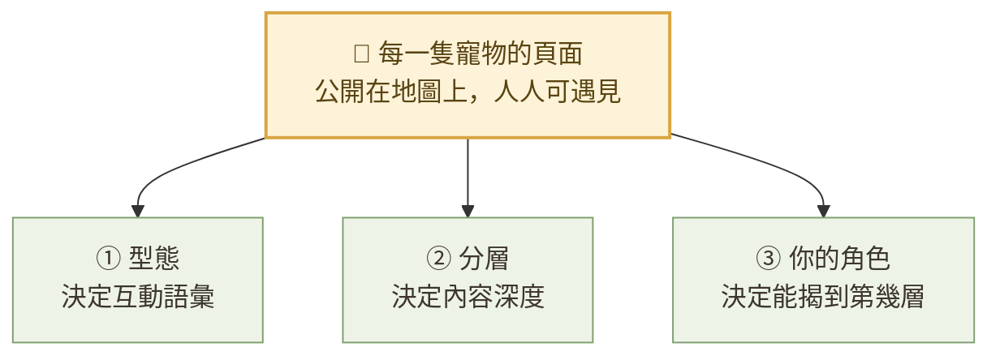
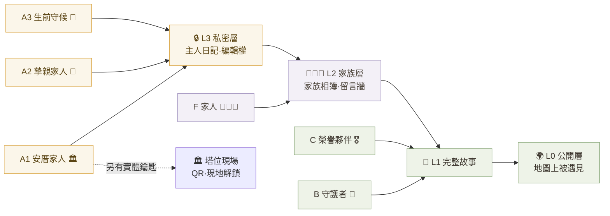
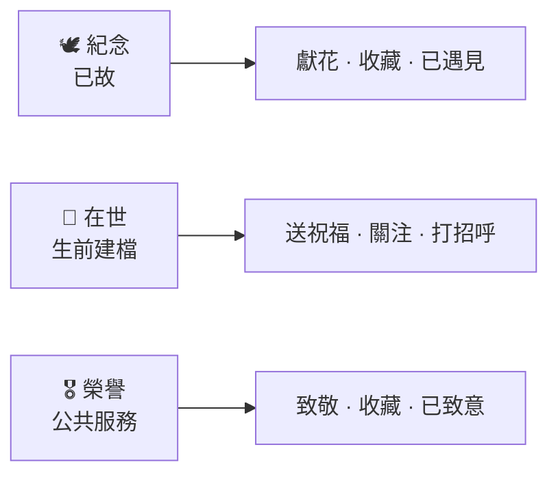
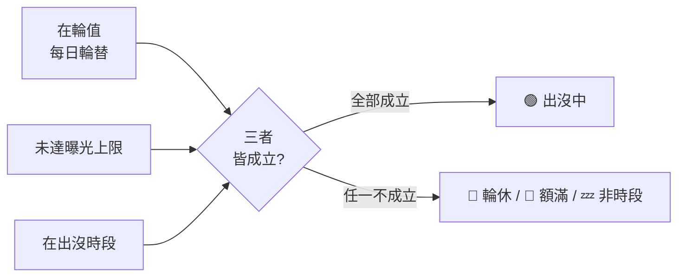
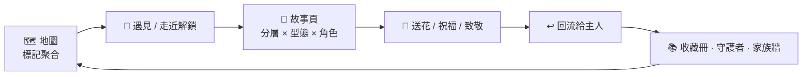
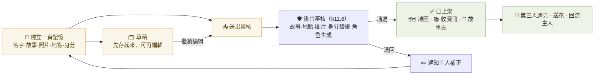
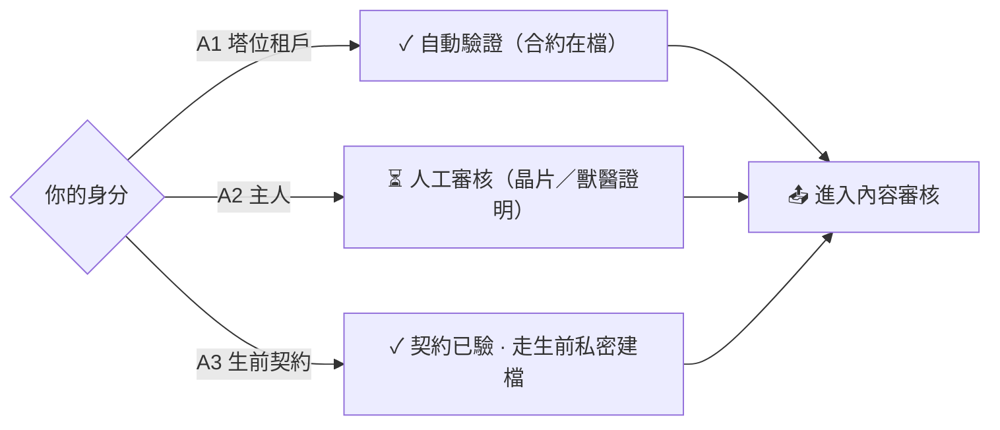

# Pet Memory Map · 使用者分級與私密陪伴規格 v0.1

> 附屬於《Pet Memory Map Project v1.0 專案訂版文件》。
> 本文件定義「使用者角色」與「對特定寵物的私密陪伴差異」，供 App 權限、審核（§11.6）、
> 商業模式（§15）與內容管線共同引用。

---

## 0. 核心原則（最重要）

**分級不是帳號等級（不分高／中／低），而是「你和『某一隻特定寵物』的關係有多近」。**

- 「級別」掛在 **「人 ↔ 某一隻寵物」的關係** 上，不是掛在帳號上。
- 同一個帳號，可以同時是：自己貓的「摯親家人」、鄰居狗的「守護者」、一隻退役警犬的「榮譽夥伴」。
- A 類（主人）是「私密 → 可控公開」；C 類（機關）反過來是「本來就該被大家記得」。
- 因此這是一張**關係地圖**，不是一條高低直線。

### 0.1 私密感 = 洋蔥式分層（重要修訂）

私密感差異 **不是靠「把寵物藏起來」**，而是靠 **「同一隻公開可被遇見的寵物，向不同關係揭開不同深度」**。

- **所有寵物都在公開地圖被「遇見」**——包含在世寵物（🌱）與榮譽夥伴（🎖️）。
- 每一頁都是 4 層洋蔥，主人可逐項設定每則內容的公開層級：

| 層 | 名稱 | 誰看得到 |
|---|---|---|
| **L0** | 公開層 | 人人（地圖上：名字、一張照片、一句話、公共地點、公開互動） |
| **L1** | 完整故事層 | 公開／匿名公開（完整故事，主人身分可隱藏） |
| **L2** | 家族層 | 家人 |
| **L3** | 私密層 | 只有主人（A1 另加「實體現場鑰匙」） |

- **三個「私密感旋鈕」**：① 深度（能揭到第幾層）② 實體鑰匙（A1 獨有：某些內容非到塔位現場不解）③ 在世狀態（生前＝祝福／陪伴；身後＝獻花／紀念；機關＝致敬／榮譽）。
- 角色 → 可揭深度：A1/A2/A3 → L3；B → L0–L1；C → L0–L1（公開榮譽，無私密層）。

---

## 1. 三大類 / 五角色

| 大類 | 代號 | 角色名 | 定位 | 對該寵物的私密度 |
|---|---|---|---|---|
| **A. 摯親（真正的主人）** | **A1** | 安厝家人 | 真主人＋租有塔位 | 最私密＋塔位現場/實體連動（可揭 L3） |
| | **A2** | 摯親家人 | 真主人＋無塔位 | 最私密（無塔位服務，可揭 L3） |
| | **A3** | 生前守候 | 真主人＋生前契約，寵物**在世** | 在世也在公開地圖（公開層＝陪伴中，可送祝福）；私密日記僅家人 |
| | **F** | 家人 | 家人（非主帳號） | 可揭到 **L2 家族層**（家族相簿、留言牆、完整故事）；**看不到** L3 主人日記與編輯權 |
| **B. 動物摯友（沒有這隻寵物）** | **B** | 守護者 | 因喜愛動物而來陪伴 | 公共陪伴層 |
| **C. 機關（公共服務動物）** | **C** | 榮譽夥伴 | 警犬/導盲犬/緝毒犬/救災犬… | 刻意公開，做成 IP＋協助後事 |

---

## 2. 私密陪伴差異（能力矩陣）

各角色對**該隻寵物**能做什麼。這就是「私密陪伴差異」的定義。

| 能力 | A1 安厝家人 | A2 摯親家人 | A3 生前守候 | B 守護者 | C 榮譽夥伴 |
|---|:--:|:--:|:--:|:--:|:--:|
| 完整私密故事／私人相簿・影片 | ✅ | ✅ | ✅（私密草稿） | — | 機關授權 |
| 編輯內容與公開範圍控制 | ✅ | ✅ | ✅ | — | 機關管理者 |
| 收下並回應陌生人的花 | ✅ | ✅ | ✅ | — | ✅ |
| 誰來過／誰送花的私密名冊 | ✅ 詳細 | ✅ | ✅ | — | ✅ 公開榮譽榜 |
| 忌日・年度紀念內容 | ✅ 自動＋專人 | ✅ 自動 | 生日／服役紀念 | — | 退役／殉職紀念 |
| 塔位**現場連動**（QR・現地解鎖・實體獻花↔數位） | ✅ | — | — | — | （機關現場） |
| 在世也在公開地圖（公開層＝陪伴中，可送祝福），私密日記僅家人 | — | — | ✅ | — | — |
| 互動語彙 | 獻花／遇見 | 獻花／遇見 | **祝福／打招呼** | 依對象 | **致敬／致意** |
| 公開探索（對別人的寵物送花/收藏/遇見） | ✅ | ✅ | ✅ | ✅ | ✅ |
| 成為守護者 | ✅ | ✅ | ✅ | ✅ 核心 | ✅ 集體守護 |
| 榮譽／公益頁 | — | — | — | 支持 | ✅ 核心 |

---

## 3. 身分驗證機制（對接 §11.6 後台審核）

| 角色 | 如何證明 | 審核方式 |
|---|---|---|
| A1 安厝家人 | 塔位租約已在檔 | **自動驗證**（塔位主檔比對） |
| A2 摯親家人 | 晶片號／獸醫或火化證明／有時間軸的照片 | 人工審核 |
| A3 生前守候 | 生前契約已在檔 | 契約比對 |
| B 守護者 | 不需驗證 | 直接開通 |
| C 榮譽夥伴 | 機關公文／授權書 | 機關對接＋人工審核 |

> 驗證失敗 → 僅能以 B（守護者）身分互動，不得取得私密權限。

---

## 4. A1 塔位專屬服務（本輪選定三方向）

> 只保留「與地點式記憶本質相符、不越界 §20」的方向。**家族共管暫緩**（列入 backlog）。

### 4.1 現場連動
- 實體塔位貼 **QR** → 掃碼直接開該寵物的 Museum Page。
- **現地解鎖**：到塔位現場（地理圍籬）才解鎖的私密留言／影像，延續 §10 接近解鎖機制。
- **實體獻花 ↔ 數位獻花連動**：現場獻花登記後，數位頁同步 +1；線上送花可選擇轉為現場代獻。

### 4.2 年度紀念內容
- 忌日／生日**自動生成紀念短片**（用已授權的照片與故事）。
- 每年**專人協助更新一次**故事（對應 §15.1 年度維護費）。

### 4.3 IP／兒童改編優先
- 優先進入 YouTube 內容池與兒童故事改編排程。
- 角色圖／動畫**優先產製**。
- 需主人於權限勾選「允許改編為兒童內容」（沿用建立頁開關）。

---

## 5. C 榮譽夥伴（公共服務動物）特殊軌

- **本質公開**：不走私密，走公眾榮譽與生命教育。
- 平台協助：製作 **IP**（角色化）、**料理後事**、建立**公開榮譽頁**（服役紀錄、退役／殉職紀念）。
- 可掛為**公益故事**（§15.4），適合兒童內容與地圖探索系列。
- 守護者可對其進行「集體守護」。

---

## 6. 與訂版文件的對應（確認不漂移）

| 本文件 | 對應訂版文件 |
|---|---|
| 五角色 | §6 JTBD 的細化（新增私密／驗證維度） |
| 能力矩陣・私密名冊・編輯權 | §13 權限資料（私人/家族/匿名/公開） |
| A1 塔位服務 | §14 塔位處理、§15.1 塔位增值 |
| A3 生前守候 | §15.2 數位紀念方案（延伸「生前建檔」） |
| B 守護者 | §15.3 Guardian 會員 |
| C 榮譽夥伴 | §15.4 IP／公益 |
| 驗證機制 | §11.6 後台審核 |

**未納入 v1（backlog）**：跨角色的複雜權限委派、機關批次匯入。

---

## 6.1 出沒的兩道保護（§10.3 · 也是私密感的一部分）

私密感不只在「內容分層」，也在「牠被多少人、在什麼時候遇見」——由主人控制：

- **每日曝光上限**：每隻寵物可設每日最多被遇見的次數。達上限即顯示「🌙 今日已達曝光上限」，當日不再被記錄遇見，明日歸零。避免被過度打擾。
- **每日輪替**：地圖每天輪流讓不同寵物「現身」，未輪值者顯示「🛌 今日輪休」。降低單一寵物過曝，也給第三人「明天再來」的理由。
- 綜合現身條件 = **在輪值 ∧ 未達曝光上限 ∧ 在出沒時段**，三者皆成立才是「🟢 出沒中」。

---

## 7. 開放問題（待決）

1. A1「現地解鎖」的地理圍籬半徑與塔位座標是否公開為地圖節點？（傾向：**不公開**，僅家人現場觸發。）
2. A2 的驗證嚴謹度與人工審核成本。
3. C 的機關對接流程與授權書範本。
4. 生前守候（A3）在寵物離世時，如何一鍵從「私密建檔」轉為「公開紀念」。

---

## 8. 架構圖（角色 × 分層 × 型態）

> 以下為 Mermaid 圖，於 GitHub / 支援 Mermaid 的檢視器會自動渲染。

### 8.1 三軸總覽

一隻寵物的頁面，由三個正交維度共同決定它「對你長什麼樣子」：

### 8.2 角色 → 可揭分層（洋蔥式）

私密感＝你和這隻寵物的關係，決定你能揭到第幾層；A1 另有「實體現場鑰匙」：

> 揭到深層即包含所有淺層（L3 ⊃ L2 ⊃ L1 ⊃ L0）。

### 8.3 型態 → 互動語彙

同一套機制（送花／收藏／遇見），依寵物型態換上不同語彙：

### 8.4 出沒三條件（§10.3）

### 8.5 核心閉環（§9）

### 8.6 主人端閉環：建立 → 審核 → 上架（§9 主人半邊 · §11.6）

寵物在主人端有三個狀態：**🗂️ 草稿 → 🕑 審核中 → ✅ 已上架**，都在「我的寵物」列表管理。

**身分驗證（§11.6）決定審核路徑**：

> 地點安全：選公共地點自動通過；選「從地圖自訂」會標記 ⚠，需後台人工確認是否為公共場所（不得反推住址）。
